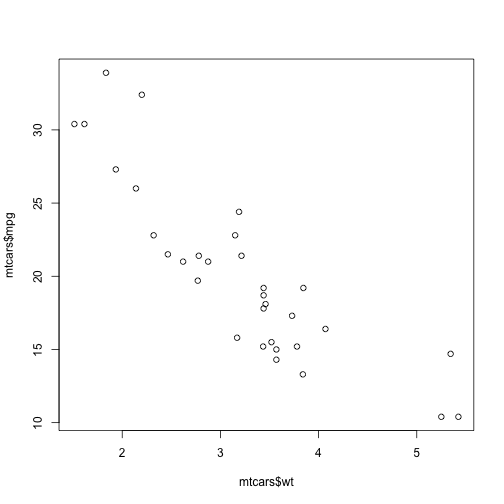

# Motor Trend Cars
## Lets Talk About Cars

---

## Some Fun Facts About cars

### Facts

1. Cars have four wheels
2. Some cars are really fast
3. The Gemlin is very underrated

### Fictions

1. Cars can drive them selves
2. We'll have flying cars in 2010

---

## Cars Look Really nice

---

## Another Peak At Our Data

| &nbsp;                  |  mpg  |  cyl  |  disp  |  hp  |  drat  |  wt   |
|:------------------------|:-----:|:-----:|:------:|:----:|:------:|:-----:|
| **Mazda RX4**           |  21   |   6   |  160   | 110  |  3.9   | 2.62  |
| **Mazda RX4 Wag**       |  21   |   6   |  160   | 110  |  3.9   | 2.875 |
| **Datsun 710**          | 22.8  |   4   |  108   |  93  |  3.85  | 2.32  |
| **Hornet 4 Drive**      | 21.4  |   6   |  258   | 110  |  3.08  | 3.215 |
| **Hornet Sportabout**   | 18.7  |   8   |  360   | 175  |  3.15  | 3.44  |

Table: The first six columns and 5 rows of mtcars data

---&twocol

## Analyzing The Data

### We can display two columns with a custom layout.

*** {name: left}

<!-- html table generated in R 3.2.1 by xtable 1.8-2 package -->
<!-- Wed Mar  2 12:45:26 2016 -->
<table border=1>
<tr> <th>  </th> <th> Estimate </th> <th> Std. Error </th> <th> t value </th> <th> Pr(&gt;|t|) </th>  </tr>
  <tr> <td align="right"> (Intercept) </td> <td align="right"> 37.2851 </td> <td align="right"> 1.8776 </td> <td align="right"> 19.86 </td> <td align="right"> 0.0000 </td> </tr>
  <tr> <td align="right"> mtcars$wt </td> <td align="right"> -5.3445 </td> <td align="right"> 0.5591 </td> <td align="right"> -9.56 </td> <td align="right"> 0.0000 </td> </tr>
   </table>

*** {name: right}

---

